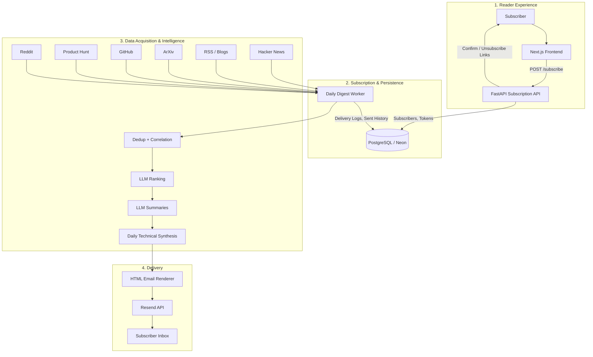

<div align="center">


<br/>

[](https://www.python.org/)
[](https://openai.com/)
[](https://langchain-ai.github.io/langgraph/)
[](https://fastapi.tiangolo.com/)
[](https://nextjs.org/)
[](https://www.postgresql.org/)

<br/>

> **OmniBrief is an AI-powered technical newsletter platform that scans the global AI frontier, curates the highest-signal developments, and delivers one sharp daily briefing to your inbox.**

<br/>

</div>

---

## Overview
OmniBrief is a **high-signal AI discovery and newsletter platform** built for engineers, researchers, and technical founders. It collects updates from ArXiv, GitHub, RSS feeds, Product Hunt, Hacker News, and Reddit, ranks them with an LLM-driven pipeline, synthesizes the day into a concise technical report, and sends the same daily digest to all active subscribers.

Unlike a simple aggregator, OmniBrief combines:
- **source aggregation** across research, code, launches, and community discussions
- **LLM-based ranking and summarization** for technical relevance
- **email subscription flows** with confirmation and unsubscribe support
- **persistent delivery and deduplication state** in PostgreSQL

## The "Why"
AI is moving too fast for manual tracking. Important papers, repos, product launches, and implementation ideas are scattered across dozens of feeds every day, and most of that stream is repetitive, shallow, or late.

OmniBrief was built to compress that chaos into one calm daily read. It acts as a technical signal layer that:
- **Keeps up with the global pace:** Tracks research, tooling, launches, and community signals in one pipeline.
- **Understands the signal:** Uses AI to rank, summarize, and synthesize technical developments instead of forwarding raw links.
- **Removes friction for readers:** Users subscribe with an email, confirm once, and then receive the briefing automatically every day.
- **Stays production-oriented:** Uses a dedicated API, a scheduled worker, and PostgreSQL-backed persistence for subscriber and delivery state.

---

## System Architecture
OmniBrief operates as a small production system with a public frontend, a subscription API, and a scheduled digest worker.



## Key Features
- **Multi-source AI scouting:** Pulls from ArXiv, GitHub, RSS feeds, Product Hunt, Hacker News, and Reddit.
- **LangGraph-based intelligence pipeline:** Curates, ranks, summarizes, critiques, and synthesizes the most relevant items.
- **Technical email digest:** Sends one clean daily report instead of a stream of raw links.
- **Public subscription workflow:** Includes subscribe, email confirmation, and unsubscribe flows through FastAPI.
- **PostgreSQL-backed persistence:** Stores subscribers, tokens, sent-item history, and delivery logs in Neon/PostgreSQL.
- **Frontend + API split:** Uses a Next.js landing page and a backend API that can be deployed independently.

## Setup
You can run OmniBrief locally with the backend, worker, and frontend separated.

### 1. Clone the project
```bash
git clone https://github.com/tanishra/OmniBrief.git
cd OmniBrief
```

### 2. Create environment files
Create a backend `.env` from the example:

```bash
cp .env.example .env
```

Important values to set in `.env`:
- `OPENAI_API_KEY`
- `RESEND_API_KEY`
- `DATABASE_URL`
- `APP_BASE_URL`
- `NEWSLETTER_TOKEN_SECRET`
- `ADMIN_EMAIL`
- `SENDER_EMAIL`
- `SENDER_NAME`

For local testing, `APP_BASE_URL` can be:

```env
APP_BASE_URL=http://localhost:8000
```

If you are running the frontend locally, include:

```env
FRONTEND_ORIGINS=http://localhost:3000
```

### 3. Install backend dependencies
```bash
pip install -r requirements.txt
playwright install chromium
```

### 4. Run the subscription API
```bash
uvicorn app:app --reload
```

The API will be available at:

```bash
http://localhost:8000
```

### 5. Run the daily worker manually
In a new terminal:

```bash
python main.py
```

This runs the full digest pipeline and sends the newsletter to active subscribers.

### 6. Run the frontend
In another terminal:

```bash
cd frontend
npm install
```

Create a local frontend env file:

```bash
cp .env.example .env.local
```

Then set:

```env
NEXT_PUBLIC_API_BASE_URL=http://localhost:8000
```

Start the frontend:

```bash
npm run dev
```

The landing page will be available at:

```bash
http://localhost:3000
```

### 7. Local test flow
Once everything is running:
- open the frontend
- submit an email
- confirm the subscription from your inbox
- run `python main.py`
- verify delivery logs and sent history in PostgreSQL

---

## Contributing
Contributions are welcome. For larger changes, open an issue first so the direction stays aligned with the product and deployment model.
