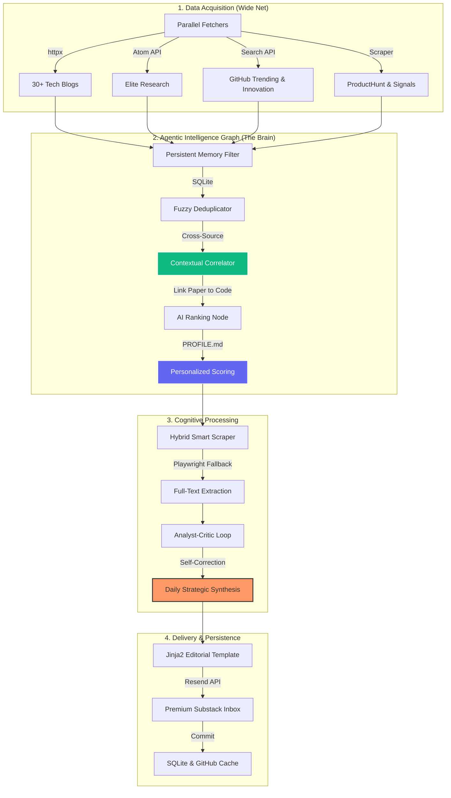

<div align="center">


<br/>

[](https://www.python.org/)
[](https://openai.com/)
[](https://langchain-ai.github.io/langgraph/)
[](https://playwright.dev/)
[](https://www.sqlite.org/)

<br/>

> **OmniBrief is an autonomous discovery engine that scans the global AI frontier, using a multi-agent LangGraph pipeline to deliver a high-signal technical briefing directly to your inbox.**

<br/>

</div>

---

## Overview
OmniBrief is a **high-signal discovery platform** that autonomously scans the global AI landscape (ArXiv, GitHub, RSS, Technical Blogs) to deliver a personalized, technical research briefing. Unlike simple aggregators, it uses a **stateful agentic graph** to "think," "rank," and "correlate" information based on your personal interest profile.

## The "Why"
In the hyper-accelerated world of Artificial Intelligence, the "half-life" of knowledge is measured in days. Manually scouring ArXiv, GitHub, Reddit, and technical blogs every morning to find the signal in the noise has become a full-time job. 

I built **OmniBrief** to automate the research lifecycle. It acts as an autonomous technical analyst that:
- **Keeps up with the global pace:** Scans 30+ sources, from elite labs to underdog innovators.
- **Understands the signal:** Uses AI to read full-text articles and code, not just headlines.
- **Tailored to you:** Prioritizes specific frameworks and architectures defined in your personal profile.
- **Delivers value daily:** Sends a high-density report every morning at a specified time, ensuring you never miss a breakthrough while you sleep.

---

## System Architecture
The engine operates as a cyclical intelligence pipeline orchestrated by **LangGraph**.



## Key Features
- **Agentic Workflow:** Built with LangGraph for stateful, recoverable, and iterative processing.
- **Authority-Based Scouting:** Explicitly monitors elite labs (DeepSeek, HKUST, Microsoft, OpenAI) for underdog releases.
- **Full-Text Analysis:** Bypasses "headline-only" summaries by using **Playwright** to scrape and read the actual technical articles.
- **Cross-Source Correlation:** Automatically identifies when a new ArXiv paper has an official GitHub implementation and links them.
- **Personalized Ranking:** Uses your `PROFILE.md` to score and prioritize content matching your specific tech stack and interests.
- **Cost Auditing:** Built-in private token tracking to monitor OpenAI API budget.

## Setup
1. **Clone & Install:**
   ```bash
   pip install -r requirements.txt
   playwright install chromium
   ```
2. **Configure Profile:**
   Edit `PROFILE.md` to describe your technical interests in natural language.
3. **Set Environment:**
   Copy `.env.example` to `.env` and add your `OPENAI_API_KEY`, `RESEND_API_KEY`, and `GITHUB_TOKEN`.
4. **Run:**
   ```bash
   python main.py
   ```